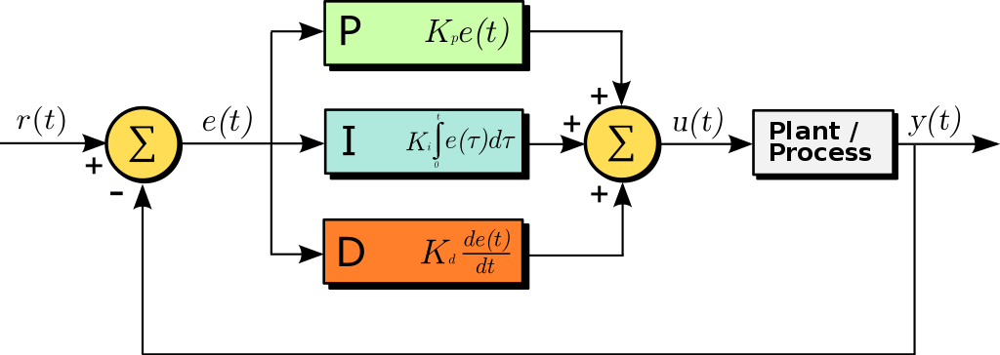
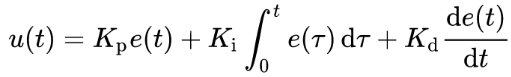
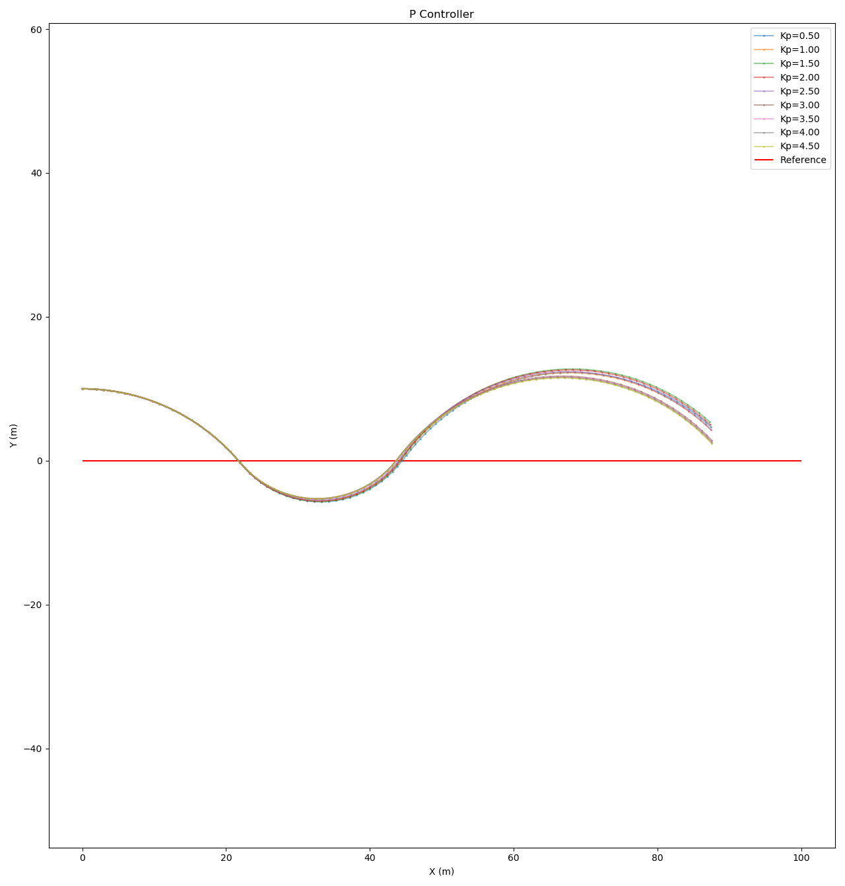
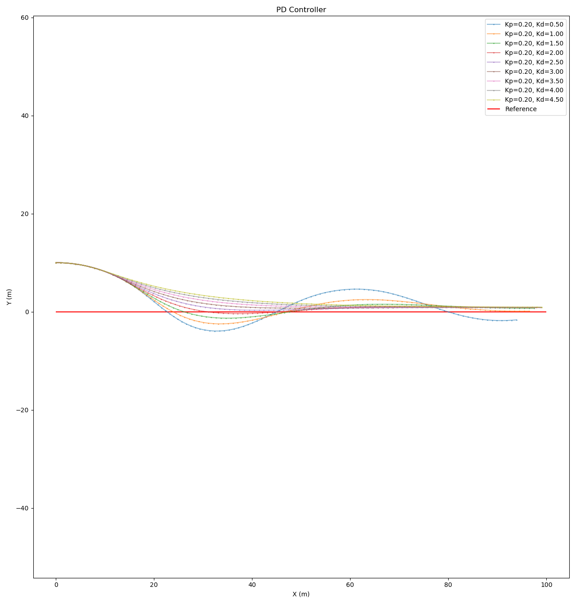
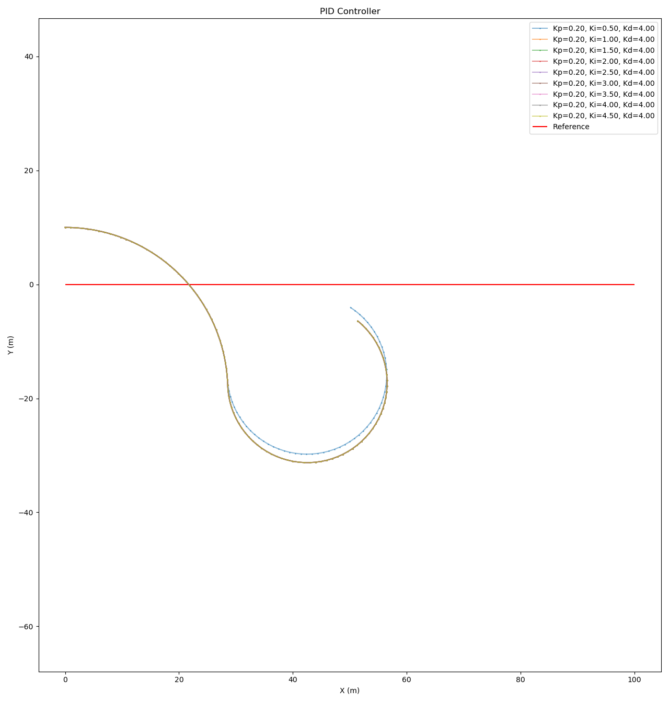
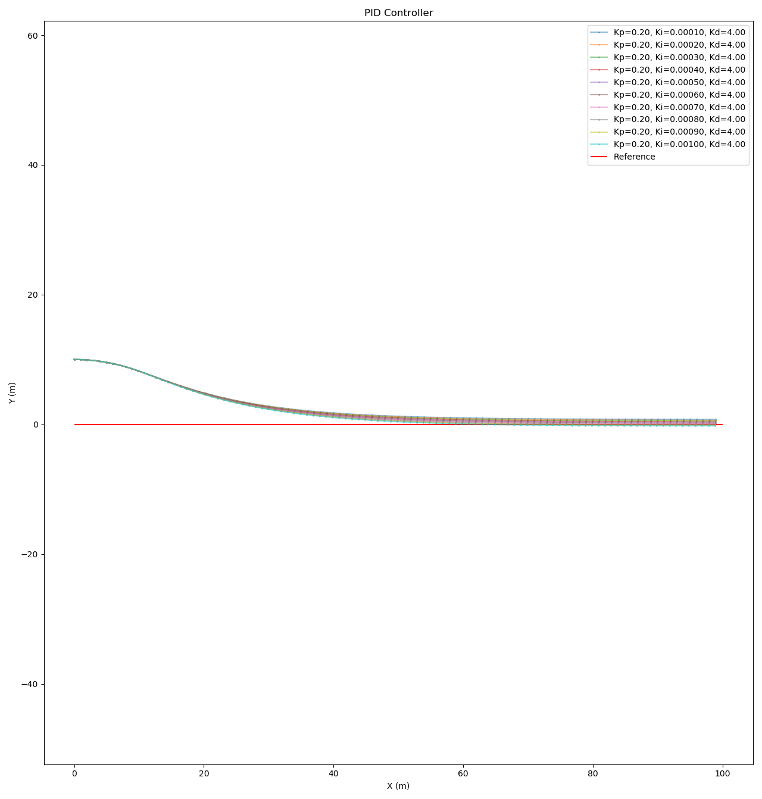
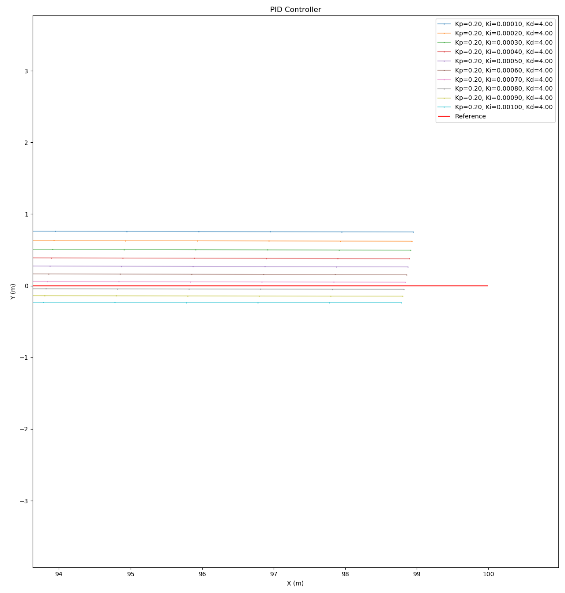

# PID Control
This project implements a PID Controller that can be used to drive a vehicle in Udacity CarND simulator. For more details see [Description](#Description)

## Dependencies

* [cmake](https://cmake.org/install/) >= 3.5
* make >= 4.1
* g++ >= 5.4
  * macOS: [Xcode](https://developer.apple.com/xcode/features/)
  * Windows: [MinGW](http://www.mingw.org/)
* [uWebSockets](https://github.com/uWebSockets/uWebSockets)
    ```shell
    git clone https://github.com/uWebSockets/uWebSockets
    cd uWebSockets && git checkout e94b6e1
    cmake -S . -B build && cmake --build build -j 16 && sudo make install
    ```
* [libfmt](https://github.com/fmtlib/fmt) >= 6.1, install from package manager or build from source
  ```shell
  apt-get install libfmt-dev
  ```
  ```shell
  git clone https://github.com/fmtlib/fmt.git
  cd fmt && cmake -S . -B build -DCMAKE_BUILD_TYPE=Release
  cd build && make install
  ```
* [Udacity CarND Simulator](https://github.com/udacity/self-driving-car-sim/releases)
  * Select PID Control tab in term 2 simulator.

## Build
```shell
cd YOUR_CLONE_PATH
cmake -S . -B build -DCMAKE_BUILD_TYPE=Release
cmake --build build -j16
./build/pid
```

## Description

### PID Control



*Image Courtesy: [Wikipedia](https://en.wikipedia.org/wiki/PID_controller#Fundamental_operation)*

Its mathematical form is,



*Image Courtesy: [Wikipedia](https://en.wikipedia.org/wiki/PID_controller#Mathematical_form)*

Here, in this project,
- `r(t)` is the command variable which is the variable we wan to follow.
- `e(t)` is the error term which is the input to the PID controller.
- `u(t)` is the output control signal from actuator, and this actuator takes in the PID control output value and produce an actual control signal which will take effect on the actual `Plant/Process`.
- `y(t)` is the controlled variable. This variable will be observed by and external sensor, here the actual steering angle, and feed back to the PID controller.
- `Plant/Process` is the the process we want to control, in this case, the steering angle for instance.

The basic idea of a PID controller is, at first the controller will produce an controller signal, and that signal will be observed by the sensor. By calculating the error between the commanded value and the actual output value, the PID control will figure out what should be the current output value given the previous error.

Here we can easily see that by computing a weighted sum of the three components, can be generate an overall output signal. The three weights, namely `Kp`, `Ki` and `Kd`, are three parameters people need to tune to make the PID control work better.

In the [wikipedia](https://en.wikipedia.org/wiki/PID_controller#Loop_tuning) loop tuning section, one might also find various kinds of tuning method for these three parameters.

Now, let's take a look at all three components in a PID controller, namely the P, I and D component respectively.

#### The Proportional Component
The P represents the proportional component. Simply speaking, when the error is large, the P controller will produce a large control signal proportional to the large error, and when the error is small, the controller will produce a smaller signal. This component represents how the controller will respond to the present error.

The effect can be illustrated by the same 2D robot example used in `main.py`.



> *P Controller*

The robot started `x=0, y=20, orientation=0` from is trying to move along `y=0` lines and the error that it's going to minimize is the cross-track error (CTE). As we can see that, the strength of the output signal is proportional to the current CTE and the weight `Kp` simply amplified this output signal.

However, as we can also see that even through it's trying to get closer to the target track, it never "converge" to the target track close enough.

#### The Derivative Component
The D represents the derivative component. It keeps track of the previous error, and computes the difference between it and the current error. By doing so, it tries to predict the future error using the current slope approximation.
As an example, we reuse the previous setup but fix `Kp` to 0.2, and vary `Kd` to see the effect.



> *PD Controller*

As we can see that, when we have a larger weight on the D component, the robot actually converges and approached to the target track in a more graceful manner.

#### The Integral Component
The I represents the integral component. It keep tracks of the summation of the previous errors. When we check the previous plot from PD controller, one might notice that even through the trajectory is converging, but it's actually reaching the real goal at all. This is because for real systems, they are not perfect, and they will contain a type of error called [steady-state error](https://en.wikipedia.org/wiki/PID_controller#Steady-state_error) and cause the system to converge to an steady states. The cause might be the mechanical execution of the steer is inexact, and there is an intrinsic drift inside.

Here in the experiment, we've added artificial drift into the vehicle which caused this effect.

To solve this, we need to keep track of the all of the errors from the past and add it into the controller formulation. The reason is that when system converges, the left error is coming from the steady state error, and by taking this error into account and compensate for it. we will be able to reach the real goal.

In the following experiment, we reuse the previous setup and choose the optimal `Kp` and `Kd` from previous results.

##### Experiment 1
We chose a set of rather large `Ki`s.



> *PID Controller Experiment 1*

We can see that, because the integral term is collecting all past error such that when `Ki` is huge, the error term will overwhelm other terms. By observing this result, we need to tune `Ki` to a set of smaller values.

##### Experiment 2

|  Overview | Zoom in at the end of the trajectory |
|-----------|---------|
|  | |

We can clearly see that bye setting `Ki` to a much smaller value, we get a much better trajectory, and the optimal `Ki` is somewhere between `0.0007` and `0.0008`, we can certainly increase the resolution to get even better trajectory.

#### Parameter Tuning
Now we've seen the three components and the effect of the values of their parameters. The question is now how to tweak them. There are multiple ways to do this as showed in the [wikipedia loop tuning](https://en.wikipedia.org/wiki/PID_controller#Loop_tuning) section. Here we typically present a method call coordinate ascent (or twiddle or uphill climbing). It's very similar to gradient descent, but it only requires to find a improvement but not a the optimal improvement in the current step. The basic idea behind this method is to trial and error. This algorithm will try to increase or decrease the parameters one by one and see the effect, if the overall error decreases, increase or decrease more. In this repo it's implemented in `pid_controller.cpp` as `CoordinateAscentOptimizer`.

#### Integral Windup
An additional problem with PID control is called [Integral Windup](https://en.wikipedia.org/wiki/Integral_windup). One can see an easy example that, suppose you have a drone, and you turn it on but grab it in your hand and don't let go. If we use a PID controller inside, the integral part will keep accumulating before it reach the commanded height. At this point when you let go, the drone will keep arising even after it passes the commanded height. The obvious reason is that because it accumulated a lot of errors and it will require the PID controller to "consume" all of the integrated errors for it to go back to the commanded height.

Because of this, actively turning the integrator off is an necessary step to prevent this from happening. One way to do this is to use clamping. The brief ideas is that is the the current error and the clamped error are very different, we know that the integrator is contributing some redundant error into the system, in this case, we can turn the integrator off. It's implemented in `pid_controller.cpp` as `_NeedToClamp`.

### Project Details
#### Coordinate Ascent Algorithm (Twiddle)
The twiddle algorithm is run this these steps,
```python
def twiddle(robot):
    p = [0.0, 0.0, 0.0]
    dp = [3.0, 3.0, 3.0]
    N = 20
    # Run the robot with initial parameter p for N steps,
    # and accumulate err for N steps
    best_err = run(robot, p, N)
    while sum(dp) > tol:
        for i in range(len(p)):
            p[i] += dp[i]
            # Run the robot with increased parameter p for N steps,
            # and accumulate err in N steps
            err = run(robot, p, N)

            if err < best_err:
                best_err = err
                dp[i] *= 1.1
            else:
                # In opposite direction
                p[i] -= 2 * dp[i]
                robot = make_robot(y=y)
                # Run the robot with decreased parameter p for another N steps,
                # and accumulate err for N steps
                err = run(robot, p, N)

                if err < best_err:
                    best_err = err
                    dp[i] *= 1.1
                else:
                    p[i] += dp[i]
                    dp[i] *= 0.9
```
The basic idea, like mentioned before, is trial and error. Tweak one parameter, run the system for N steps, see the error, if it improves, continue to tweak the next one, otherwise tweak this parameter in the opposite direction and run the system for another N steps, and observe again, so on so forth.

#### Steering Angle Control
The initial parameters are chosen by manually tweaking, `Kp=0.225, Ki=0.0004, Kd=4.0` and the output steering angle should be in range `[-1.0, 1.0]`. The parameter deltas for twiddle algorithm is set to be 10% of the initial values.

#### Throttle Control
The initial parameters are chosen by manually tweaking, `Kp=0.225, Ki=0.0001, Kd=1.1` and the output steering angle should be in range `[0.2, 0.8]`. The lower bound 0.2 is because of in some situation the CTE will be so small such it won't provide enough acceleration, so clamp it to be at least 0.2. The parameter deltas for twiddle algorithm is set to be 10% of the initial values.

## Code Style
The python code is formatted using `black`.
The cpp code is formatted using clang format using a slightly modified version of `Mozilla` coding standard.

## Reference
* [Understanding PID Control by Matlab on YouTube](https://www.youtube.com/watch?v=wkfEZmsQqiA&list=PLn8PRpmsu08pQBgjxYFXSsODEF3Jqmm-y)
